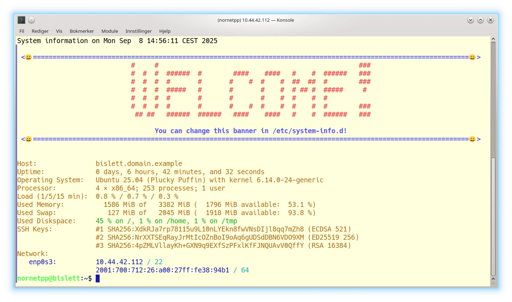
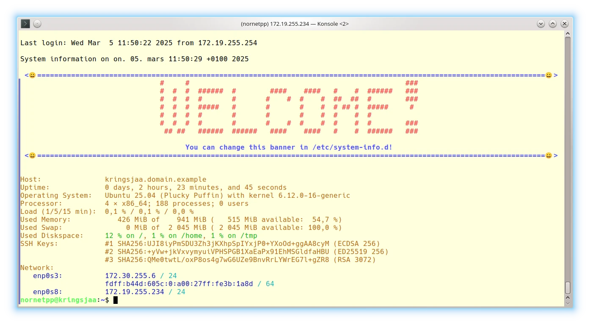
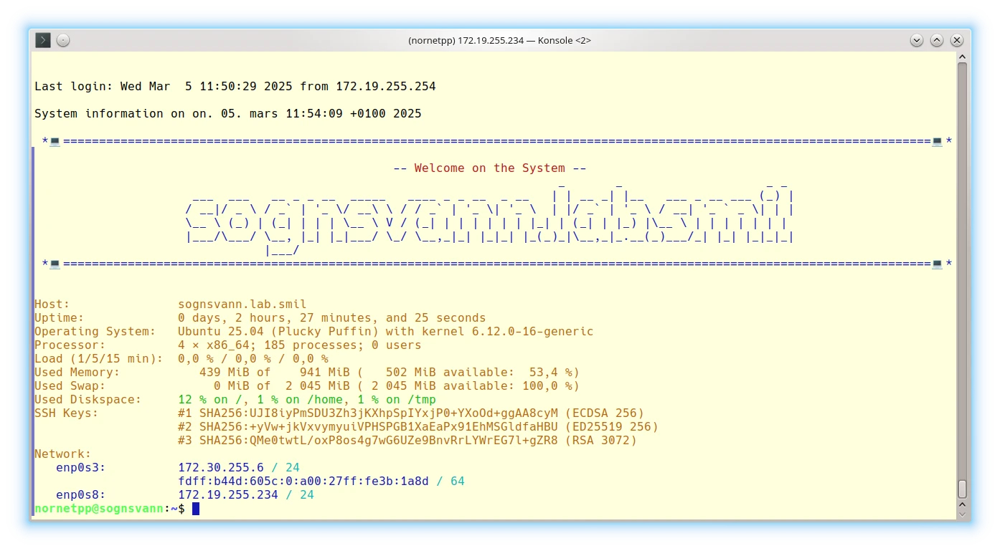
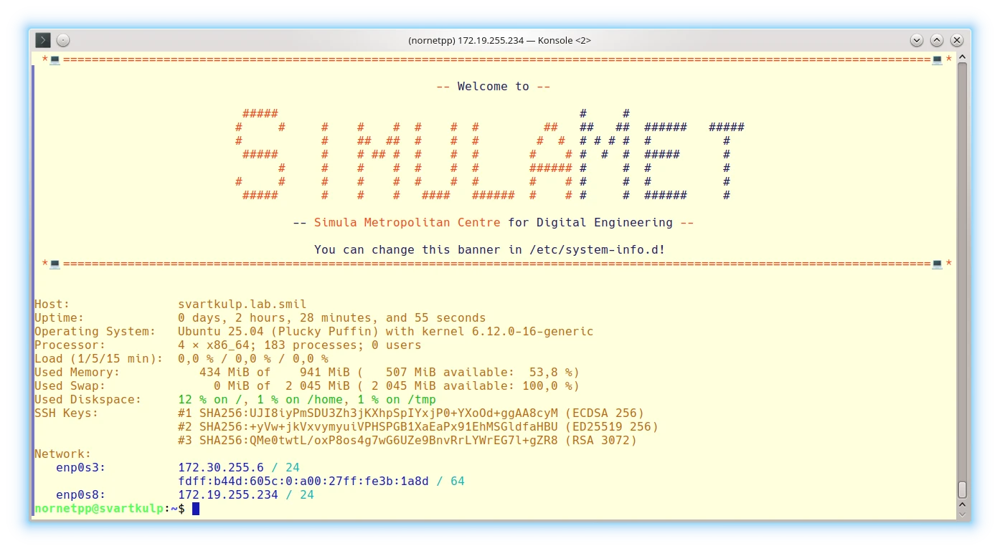
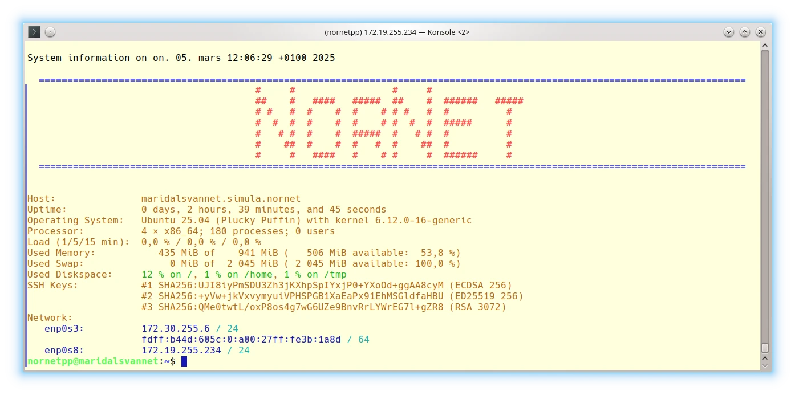
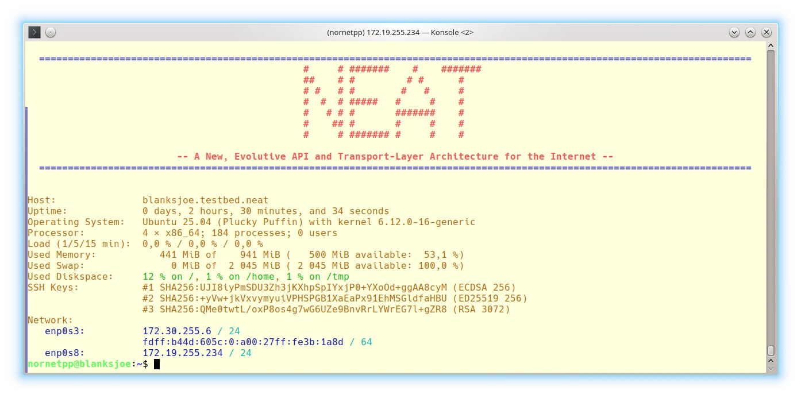
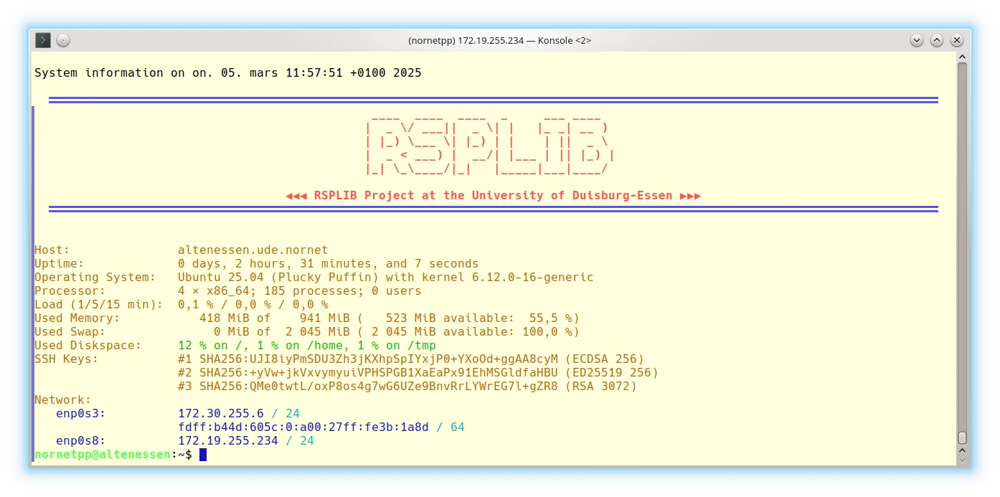
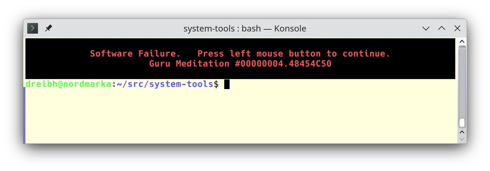

<h1 align="center">
 System-Tools<br />
 <span style="font-size: 75%">Tools for Basic System Management</span><br />
 <a href="https://www.nntb.no/~dreibh/system-tools/">
  <br />
  <span style="font-size: 75%;">https://www.nntb.no/~dreibh/system-tools</span>
 </a>
</h1>


# 💡 What is System-Tools?

System-Tools is a collection of helpful tools for basic system management of Linux and FreeBSD systems:

- [System-Info](#system-info) (display banners and system information),
- [System-Maintenance](#system-maintenance) (run basic system maintenance tasks),
- [Reset-Machine-ID](#reset-machine-id) (reset the machine identity state, particularly for a cloned VM),
- [Print-UTF8](#print-utf8) (print UTF-8 text with options for centering, adjusting, etc.),
- [Text-Block](#text-block) (flexible tool for inserting, replacing or removing text blocks in files or streams),
- [Fingerprint-SSH-Keys](#fingerprint-ssh-keys) (show the machine's SSH public key fingerprints in different formats),
- [Configure-Grub](#configure-grub) (configure options for the GRUB boot loader),
- [Try-Hard](#try-hard) (run a command, with configurable retries on failure),
- [Random-Sleep](#random-sleep) (wait for random time span, with support of fractional seconds).

# 📚 System-Info

System-Info displays basic status information about the system: hostname, uptime, CPU, memory statistics, disk space statistics, SSH public key hashes, and networking information. Furthermore, it can be configured to show one or more banners (for example, a project name). System-Info can be configured to be automatically run when logging in, providing the user an up-to-date overview of the system.

One main purpose of System-Info is to run on login, to particularly show a nice login banner (for example, a project or company logo) and then present the basic system information. For this purpose, System-Info can be configured with banner scripts (by default looked up in /etc/system-info.d or /usr/local/etc/system-info.d), which are processed in alphabetically descending order by file name, like:

* `95-application-logo`,
* `90-project-logo`,
* `60-department-logo`,
* `50-company-logo`,
* `01-example`.

The names of all scripts MUST begin with two decimal numbers. That is, scripts must be named `[0-9][0-9]...` to be processed by System-Info!

If one of the scripts exits with non-zero exit code, the processing of further banner scripts is stopped. This can be used for preconfiguring a system for example with a department and company logo, where the company logo script terminates further processing. A modified system for a certain project can add a project logo as well. The project logo script may terminate further processing, not showing department and company logos. This may be combined with packaging scripts, for example adding an application logo as part of the application's install package (like adding a script `95-application-logo`).

Some examples, using the [`banner-helper`](src/System-Info/system-info.d/banner-helper) library provided by System-Info:

<table summary="System-Info Banner Examples">
  <tr>
    <td style="vertical-align: center;">
     <p align="center">
      <a href="src/System-Info/figures/01-example.webp">
        
      </a><br />
      <tt><a href="src/System-Info/system-info.d/01-example">01-example</a></tt><br />
      The default example.
      </p>
    </td>
    <td style="vertical-align: center;">
     <p align="center">
      <a href="src/System-Info/figures/09-hostname-example.webp">
        
      </a><br />
      <tt><a href="src/System-Info/system-info.d/09-hostname-example">09-hostname-example</a></tt><br />
      Dynamically showing the hostname of the machine.
     </p>
    </td>
    <td style="vertical-align: center;">
     <p align="center">
      <a href="src/System-Info/figures/10-company-logo-example.webp">
        
      </a><br />
      <tt><a href="src/System-Info/system-info.d/10-company-logo-example">10-company-logo-example</a></tt><br />
      A <a href="https://www.simulamet.no/">SimulaMet</a> company branding.
     </p>
    </td>
  </tr>
  <tr>
    <td style="vertical-align: center;">
     <p align="center">
      <a href="src/System-Info/figures/10-nornet.webp">
        
      </a><br />
      <tt><a href="src/System-Info/system-info.d/10-nornet">10-nornet</a></tt><br />
      A <a href="https://www.nntb.no/">NorNet</a> project branding.
     </p>
    </td>
    <td style="vertical-align: center;">
     <p align="center">
      <a href="src/System-Info/figures/18-neat.webp">
        
      </a><br />
      <tt><a href="src/System-Info/system-info.d/18-neat">18-neat</a></tt><br />
      A <a href="https://neat.nntb.no/">NEAT</a> project branding.
     </p>
    </td>
    <td style="vertical-align: center;">
     <p align="center">
      <a href="src/System-Info/figures/30-rsplib.webp">
        
      </a><br />
      <tt><a href="src/System-Info/system-info.d/30-rsplib">30-rsplib</a></tt><br />
      A <a href="https://www.nntb.no/~dreibh/rserpool/">RSPLIB</a> project branding.
     </p>
    </td>
  </tr>
</table>


# 📚 System-Maintenance

System-Maintenance runs some system maintenance tasks to keep the system clean and up to date. These tasks are:

- Ensuring that all packages are configured,
- Updating the package repositories,
- Removing obsolete kernels,
- Installing all available package updates,
- Auto-removing unused packages,
- Ensuring that Grub (the bootloader) is installed and up-to-date,
- Delete network interface mapping (only on request by option, see below),
- Updating package and file search caches,
- Updating firmware,
- Trimming SSDs and virtual storage.

The typical usage is quite simple, e.g.:

```bash
sudo System-Maintenance
```

The manpage of System-Maintenance contains details and further examples:

```bash
man System-Maintenance
```


# 📚 Reset-Machine-ID

Reset-Machine-ID resets the machine identity state, particularly for a cloned VM, to make it appear as a new machine.  It performs the following tasks:

* Reset `/etc/machine-id`,
* Reset `/var/lib/dbus/machine-id` (symlink to `/etc/machine-id`),
* Change hostname, if a new one is provided.
* Provide hardened settings for SSH client and server.
* Create new SSH key pair.

The changes are made interactively on request only, unless the option `--yes-to-all-i-am-really-sure` is set.

* Reset machine ID, without changing the hostname:

  ```bash
  sudo Reset-Machine-ID
  ```

* Reset machine ID, with changing the hostname to new-hostname.domain.example:

  ```bash
  sudo Reset-Machine-ID --hostname new-hostname.domain.example
  ```

* The manpage of Reset-Machine-ID contains details and further examples:

  ```bash
  man Reset-Machine-ID
  ```


# 📚 Print-UTF8

Print-UTF8 is a simple program to print UTF-8 strings in the console with options for indentation, centering, separator as well as size/length/width information. It can e.g.&nbsp;be utilised for printing System-Info banners, or for displaying error messages like this classic Amiga [Guru Meditation](https://en.wikipedia.org/wiki/Guru_Meditation) example:

```bash
print-utf8 -n -s "\e[1;31;40;5m█" "▀" "█\e[0m"
echo -e "Software Failure.   Press left mouse button to continue.\nGuru Meditation #00000004.48454C50" | \
print-utf8 -n -C "\e[1;31;40;5m█\e[25m" "\e[5m█\e[0m"
print-utf8 -n -s "\e[1;31;40;5m█" "▄" "█\e[0m"
```

<p align="center">
  <a href="src/Print-UTF8/figures/guru.webp">
   
  </a>
</p>

The manpage of Print-UTF8 contains details and various further examples:

```bash
man print-utf8
```


# 📚 Text-Block

Text-Block is a flexible tool for automated editing operations of text blocks in files or streams:

* Copying input,
* Discarding input,
* Enumeration of lines,
* Highlighting blocks,
* Deleting blocks,
* Inserting text before/after marking, as well as
* Replacing blocks.

The blocks to be modified can be selected by begin/end tags, or line numbers. The static pages of this website are generated by using Text-Block to insert contents like publications and project lists, add new software releases, etc.

For example, the publications list in [`index.html`](https://www.nntb.no/~dreibh/index.html) is placed between the tags '&lt;!-- BEGIN-OF-PUBLICATIONS --&gt;' and '&lt;!-- END-OF-PUBLICATIONS --&gt;'. Text-Block can be used to manipulate this block:

* To extract the publications list to standard output:

  ```bash
  text-block -i index.html \
     --begin-tag '<!-- BEGIN-OF-PUBLICATIONS -->' \
     --end-tag '<!-- END-OF-PUBLICATIONS -->' \
     --extract
  ```

* To delete the publications list and write the page to output.html:

  ```bash
  text-block -i index.html -o output.html \
     --begin-tag '<!-- BEGIN-OF-PUBLICATIONS -->' \
     --end-tag '<!-- END-OF-PUBLICATIONS -->' \
     --delete``
  ```

* To replace the publications list by contents from update.block (e.g.&nbsp; generated by [BibTeXConv](https://www.nntb.no/~dreibh/bibtexconv/), and write the page to output.html:

  ```bash
  text-block -i index.html -o output.html \
     --begin-tag '<!-- BEGIN-OF-PUBLICATIONS -->' \
     --end-tag '<!-- END-OF-PUBLICATIONS -->' \
     --replace update.block
  ```

* The manpage of Text-Block contains details and various further examples:

  ```bash
  man text-block
  ```


# 📚 Fingerprint-SSH-Keys

Fingerprint-SSH-Keys prints the SSH key fingerprints of the local machine in different formats: SSH hash, DNS SSHFP RR, or Python dictionary. Its typical usage is straightforward:

```bash
Fingerprint-SSH-Keys
```

The manpage of Fingerprint-SSH-Keys contains details and further examples:

```bash
man Fingerprint-SSH-Keys
```


# 📚 Configure-Grub

Configure-Grub adjusts a GRUB configuration file by applying a configuration from a template, and merging the existing configurations settings with additional customisations. It can for example be used to set a custom screen resolution (GRUB_GFXMODE option) or startup tune (GRUB_INIT_TUNE option). The [VM Image Builder Scripts](https://github.com/simula/nornet-vmimage-builder-scripts) use Configure-Grub to configure the screen resolution and a boot splash image.

The manpage of Configure-Grub contains details and further examples:

```bash
man Configure-Grub
```


# 📚 Try-Hard

Try-Hard runs a command and retries for a given number of times in case of error, with a delay between the trials.

Example to try a file download up to 3&nbsp;times, with a delay of 60&nbsp;seconds between trials:

```bash
try-hard 3 60 -- wget -O example.tar.gz \
   https://www.example.net/example.tar.gz
```

The manpage of Try-Hard contains details and further examples:

```bash
man Try-Hard
```


# 📚 Random-Sleep

Random-Sleep waits for a random time, selected from a given interval, with support for fractional seconds.

Example to wait between 0.5&nbsp;and 299.5&nbsp;seconds:

```bash
random-sleep 0.5 299.5 && echo "Finished waiting!"
```

The manpage of Random-Sleep contains details and further examples:

```bash
man Random-Sleep
```


# 📦 Binary Package Installation

Please use the issue tracker at [https://github.com/dreibh/system-tools/issues](https://github.com/dreibh/system-tools/issues) to report bugs and issues!

## Ubuntu Linux

For ready-to-install Ubuntu Linux packages of System-Tools, see [Launchpad PPA for Thomas Dreibholz](https://launchpad.net/~dreibh/+archive/ubuntu/ppa/+packages?field.name_filter=td-system-tools&field.status_filter=published&field.series_filter=)!

```bash
sudo apt-add-repository -sy ppa:dreibh/ppa
sudo apt-get update
sudo apt-get install td-system-tools
```

## Fedora Linux

For ready-to-install Fedora Linux packages of System-Tools, see [COPR PPA for Thomas Dreibholz](https://copr.fedorainfracloud.org/coprs/dreibh/ppa/package/td-system-tools/)!

```bash
sudo dnf copr enable -y dreibh/ppa
sudo dnf install td-system-tools
```

## FreeBSD

For ready-to-install FreeBSD packages of System-Tools, it is included in the ports collection, see [FreeBSD ports tree index of net/td-system-tools/](https://cgit.freebsd.org/ports/tree/net/td-system-tools/)!

```bash
sudo pkg install system-tools
```

Alternatively, to compile it from the ports sources:

```bash
cd /usr/ports/net/td-system-tools
make
sudo make install
```


# 💾 Build from Sources

System-Tools is released under the [GNU General Public Licence&nbsp;(GPL)](https://www.gnu.org/licenses/gpl-3.0.en.html#license-text).

Please use the issue tracker at [https://github.com/dreibh/system-tools/issues](https://github.com/dreibh/system-tools/issues) to report bugs and issues!

## Development Version

The Git repository of the System-Tools sources can be found at [https://github.com/dreibh/system-tools](https://github.com/dreibh/system-tools):

<pre><code><span class="fu">git</span> clone <a href="https://github.com/dreibh/system-tools">https://github.com/dreibh/system-tools</a>
<span class="bu">cd</span> system-tools
<span class="fu">cmake</span> .
<span class="fu">make</span>
</code></pre>

Contributions:

* Issue tracker: [https://github.com/dreibh/system-tools/issues](https://github.com/dreibh/system-tools/issues).
  Please submit bug reports, issues, questions, etc. in the issue tracker!

* Pull Requests for System-Tools: [https://github.com/dreibh/system-tools/pulls](https://github.com/dreibh/system-tools/pulls).
  Your contributions to System-Tools are always welcome!

* CI build tests of System-Tools: [https://github.com/dreibh/system-tools/actions](https://github.com/dreibh/system-tools/actions).

## Release Versions

See [https://www.nntb.no/~dreibh/system-tools/#current-stable-release](https://www.nntb.no/~dreibh/system-tools/#current-stable-release) for the release packages!


# 🔗 Useful Links

* [VM Image Builder Scripts](https://github.com/simula/nornet-vmimage-builder-scripts)
* [NetPerfMeter – A TCP/MPTCP/UDP/SCTP/DCCP Network Performance Meter Tool](https://www.nntb.no/~dreibh/netperfmeter/)
* [HiPerConTracer – High-Performance Connectivity Tracer](https://www.nntb.no/~dreibh/hipercontracer/)
* [SubNetCalc – An IPv4/IPv6 Subnet Calculator](https://www.nntb.no/~dreibh/subnetcalc/)
* [NorNet – A Real-World, Large-Scale Multi-Homing Testbed](https://www.nntb.no/)
* [NEAT – A New, Evolutive API and Transport-Layer Architecture for the Internet](https://neat.nntb.no/)
* [Thomas Dreibholz's Reliable Server Pooling (RSerPool) Page – The RSPLIB Project](https://www.nntb.no/~dreibh/rserpool/)
* [5G-VINNI – 5G Verticals Innovation Infrastructure](https://www.5g-vinni.eu/)
