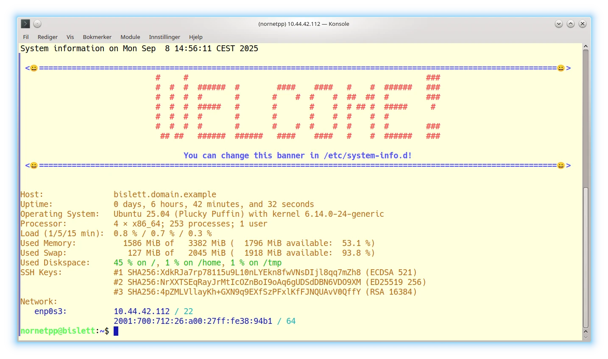
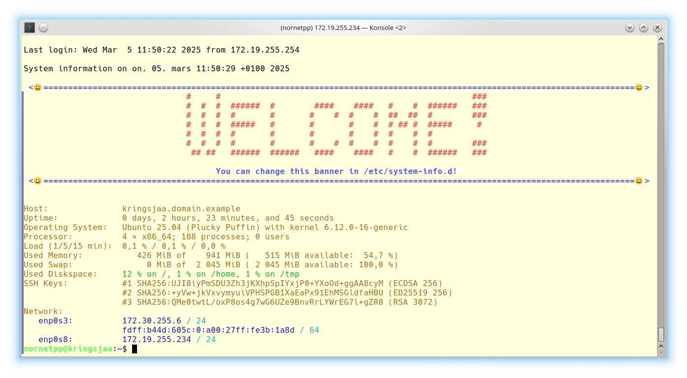
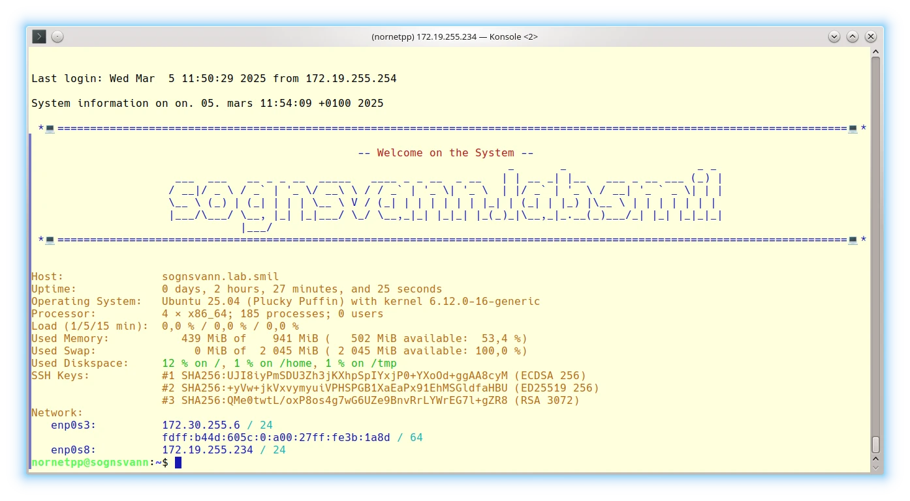
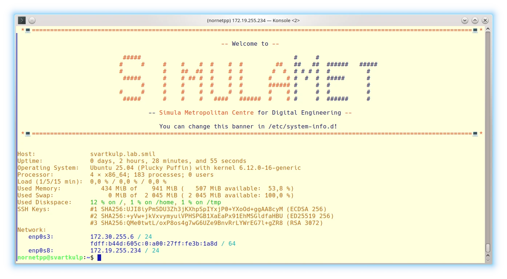
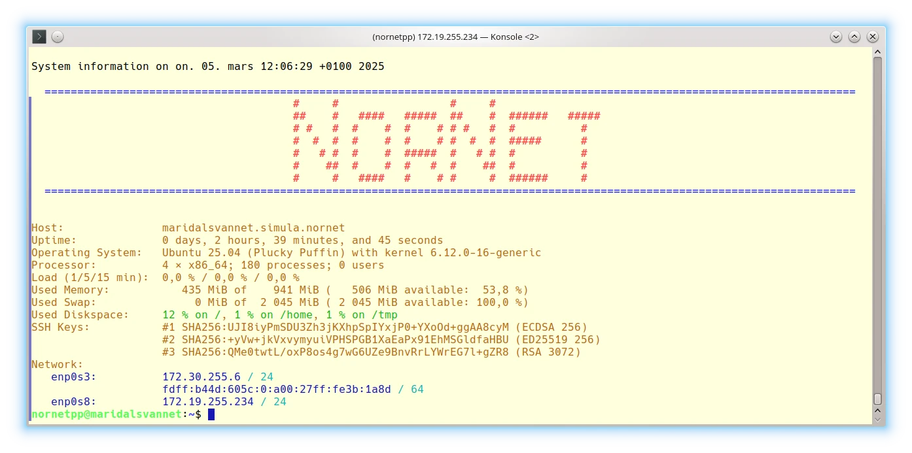
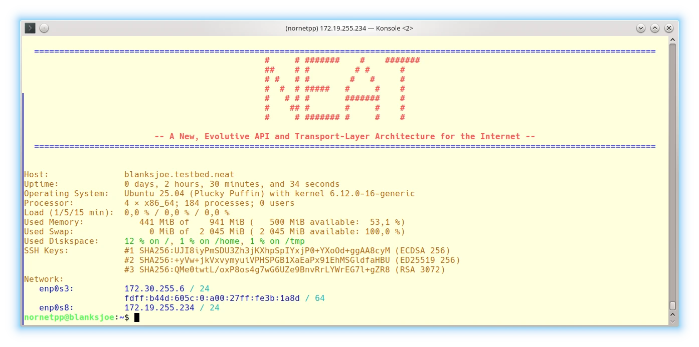
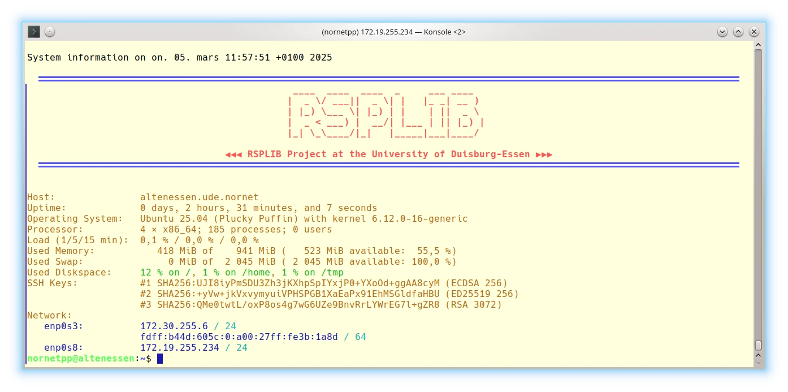
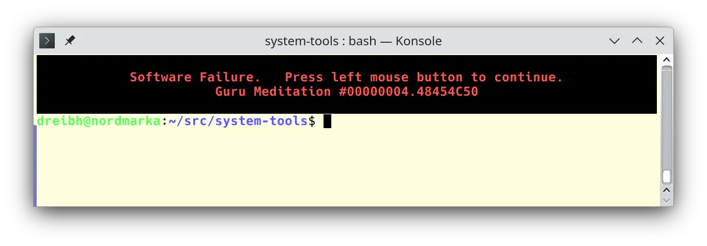

<h1 align="center">
 System-Tools<br />
 <span style="font-size: 75%">Tools for Basic System Management</span><br />
 <a href="https://www.nntb.no/~dreibh/system-tools/">
  <br />
  <span style="font-size: 75%;">https://www.nntb.no/~dreibh/system-tools</span>
 </a>
</h1>


# 💡 What is System-Tools?

System-Tools is a collection of helpful tools for basic system management of Linux and FreeBSD systems:

- [System-Info](#-system-info): Displays system status (CPU, memory, storage, network) and configurable login banners.
- [System-Maintenance](#-system-maintenance): Automates package updates, old kernel removal, and storage cleanup (e.g.,&nbsp;SSD trimming).
- [Reset-Machine-ID](#-reset-machine-id): Resets machine IDs, hostnames, and SSH keys for cloned machines.
- [Fingerprint-SSH-Keys](#-fingerprint-ssh-keys): Shows the machine’s SSH public key fingerprints in different formats.
- [Configure-GRUB](#-configure-grub): Configures options for the GRUB boot loader.
- [Print-UTF8](#-print-utf8): Prints UTF-8 text with options for centering, adjusting, etc.
- [Text-Block](#-text-block): Edits files or streams by inserting, replacing, or removing text blocks.
- [Unix-Timestamp-Tools](#-unix-timestamp-tools): Convert Unix timestamps (s, ms, us, ns) to and from date/time strings.
- [Try-Hard](#-try-hard): Retries commands with a configurable backoff.
- [Random-Sleep](#-random-sleep): Waits for a random time span, with support for fractional seconds.
- [X.509-Tools](#-x.509-tools): Provide utilities for viewing, verifying, and converting X.509 certificates, and testing TLS connections.
- [GIMP-Scripts](#-gimp-scripts): Contains a collection of scripts for graphics processing using GIMP and GraphicsMagick.

System-Tools provides internationalisation&nbsp;(i18n) support using [GNU gettext](https://www.gnu.org/software/gettext/). That is, translation files for the output of the programs are supported. You can support the project by contributing translations for your language. See [Internationalisation&nbsp;(I18N)](#internationalisation) for details!


# 📚 System-Info

System-Info displays basic status information about the system: hostname, uptime, CPU, memory statistics, disk space statistics, SSH public key hashes, and networking information. Furthermore, it can be configured to show one or more banners (for example, a project name). System-Info can be configured to be automatically run when logging in, providing the user with an up-to-date overview of the system.

One main purpose of System-Info is to run on login, to particularly show a nice login banner (for example, a project or company logo) and then present the basic system information. For this purpose, System-Info can be configured with banner scripts (by default looked up in `/etc/system-info.d` or `/usr/local/etc/system-info.d`), which are processed in alphabetically descending order by file name, like:

* `95-application-logo`,
* `90-project-logo`,
* `60-department-logo`,
* `50-company-logo`,
* `01-example`.

The names of all scripts MUST begin with two decimal digits. That is, scripts must be named `[0-9][0-9]...` to be processed by System-Info!

If one of the scripts exits with a non-zero exit code, the processing of further banner scripts is stopped. This can be used for preconfiguring a system for example with a department and company logo, where the company logo script terminates further processing. A modified system for a certain project can add a project logo as well. The project logo script may terminate further processing, not showing department and company logos. This may be combined with packaging scripts, for example adding an application logo as part of the application's install package (like adding a script `95-application-logo`).

Some examples, using the [`banner-helper`](src/System-Info/system-info.d/banner-helper) library provided by System-Info:

<table summary="System-Info Banner Examples" style="table-layout: fixed; width: 100%;">
  <tr>
    <td style="vertical-align: middle; width: 33.33%;">
     <p align="center">
      <a href="src/System-Info/figures/01-example.webp">
        
      </a><br />
      <tt><a href="src/System-Info/system-info.d/01-example">01-example</a></tt><br />
      The default example.
      </p>
    </td>
    <td style="vertical-align: middle; width: 33.33%;">
     <p align="center">
      <a href="src/System-Info/figures/09-hostname-example.webp">
        
      </a><br />
      <tt><a href="src/System-Info/system-info.d/09-hostname-example">09-hostname-example</a></tt><br />
      Dynamically showing the hostname of the machine.
     </p>
    </td>
    <td style="vertical-align: middle; width: 33.33%;">
     <p align="center">
      <a href="src/System-Info/figures/10-company-logo-example.webp">
        
      </a><br />
      <tt><a href="src/System-Info/system-info.d/10-company-logo-example">10-company-logo-example</a></tt><br />
      A <a href="https://www.simulamet.no/">SimulaMet</a> company branding.
     </p>
    </td>
  </tr>
  <tr>
    <td style="vertical-align: middle;">
     <p align="center">
      <a href="src/System-Info/figures/10-nornet.webp">
        
      </a><br />
      <tt><a href="src/System-Info/system-info.d/10-nornet">10-nornet</a></tt><br />
      A <a href="https://www.nntb.no/">NorNet</a> project branding.
     </p>
    </td>
    <td style="vertical-align: middle;">
     <p align="center">
      <a href="src/System-Info/figures/18-neat.webp">
        
      </a><br />
      <tt><a href="src/System-Info/system-info.d/18-neat">18-neat</a></tt><br />
      A <a href="https://neat.nntb.no/">NEAT</a> project branding.
     </p>
    </td>
    <td style="vertical-align: middle;">
     <p align="center">
      <a href="src/System-Info/figures/30-rsplib.webp">
        
      </a><br />
      <tt><a href="src/System-Info/system-info.d/30-rsplib">30-rsplib</a></tt><br />
      A <a href="https://www.nntb.no/~dreibh/rserpool/">RSPLIB</a> project branding.
     </p>
    </td>
  </tr>
</table>


# 📚 System-Maintenance

System-Maintenance runs some system maintenance tasks to keep the system clean and up to date. These tasks are:

- Ensuring that all packages are configured,
- Updating the package repositories,
- Removing obsolete kernels,
- Installing all available package updates,
- Auto-removing unused packages,
- Updating package and file search caches,
- Refreshing snap packages (Ubuntu),
- Updating firmware,
- Synchronizing the system time,
- Trimming SSDs and virtual storage.

The typical usage is quite simple, e.g.:

```bash
sudo System-Maintenance
```

The manpage of System-Maintenance contains details and further examples:

```bash
man System-Maintenance
```


# 📚 Reset-Machine-ID

Reset-Machine-ID resets the machine identity state, particularly for a cloned VM, to make it appear as a new machine. It performs the following tasks:

* Reset `/etc/machine-id`.
* Reset `/var/lib/dbus/machine-id` (symlink to `/etc/machine-id`).
* Change the hostname if a new one is provided.
* Provide hardened settings for SSH client and server.
* Create new SSH key pair.

The changes are made interactively on request only, unless the option `--yes-to-all-i-am-really-sure` is set.

* Reset machine ID, without changing the hostname:

  ```bash
  sudo Reset-Machine-ID
  ```

* Reset machine ID, and change the hostname to new-hostname.domain.example:

  ```bash
  sudo Reset-Machine-ID --hostname new-hostname.domain.example
  ```

* The manpage of Reset-Machine-ID contains details and further examples:

  ```bash
  man Reset-Machine-ID
  ```


# 📚 Fingerprint-SSH-Keys

Fingerprint-SSH-Keys prints the SSH key fingerprints of the local machine in different formats: SSH hash, DNS SSHFP RR, or Python dictionary. Its typical usage is straightforward:

```bash
Fingerprint-SSH-Keys
```

The manpage of Fingerprint-SSH-Keys contains details and further examples:

```bash
man Fingerprint-SSH-Keys
```


# 📚 Configure-GRUB

Configure-GRUB adjusts a GRUB configuration file by applying a configuration from a template, and merging the existing configurations settings with additional customisations. It can for example be used to set a custom screen resolution (GRUB_GFXMODE option) or startup tune (GRUB_INIT_TUNE option). The [Virtual Machine Image Builder and System Installation Scripts](https://www.nntb.no/~dreibh/vmimage-builder-scripts/) use Configure-GRUB to configure the screen resolution and a boot splash image.

The manpage of Configure-GRUB contains details and further examples:

```bash
man configure-grub
```


# 📚 Print-UTF8

Print-UTF8 is a simple program to print UTF-8 strings in the console with options for indentation, centering, separator as well as size/length/width information. It can e.g.&nbsp;be utilised for printing System-Info banners, or for displaying error messages like this classic Amiga [Guru Meditation](https://en.wikipedia.org/wiki/Guru_Meditation) example:

```bash
print-utf8 -n -s "\e[1;31;40;5m█" "▀" "█\e[0m"
echo -e "Software Failure.   Press left mouse button to continue.\nGuru Meditation #00000004.48454C50" | \
print-utf8 -n -C "\e[1;31;40;5m█\e[25m" "\e[5m█\e[0m"
print-utf8 -n -s "\e[1;31;40;5m█" "▄" "█\e[0m"
```

<p align="center">
  <a href="src/Print-UTF8/figures/guru.webp">
   
  </a>
</p>

The manpage of Print-UTF8 contains details and various further examples:

```bash
man print-utf8
```


# 📚 Text-Block

Text-Block is a flexible tool for automated editing operations of text blocks in files or streams. This allows for automated, non-interactive editing of specific sections of a file using begin and end tags or line numbers:

* Copying input,
* Discarding input,
* Enumeration of lines,
* Highlighting blocks,
* Deleting blocks,
* Inserting text before/after marking, as well as
* Replacing blocks.

The blocks to be modified can be selected by begin/end tags, or line numbers. The static pages of this website are generated by using Text-Block to insert contents like publications and project lists, add new software releases, etc.

For example, the publications list in [`index.html`](https://www.nntb.no/~dreibh/index.html) is placed between the tags '&lt;!-- BEGIN-OF-PUBLICATIONS --&gt;' and '&lt;!-- END-OF-PUBLICATIONS --&gt;'. Text-Block can be used to manipulate this block:

* To extract the publications list to standard output:

  ```bash
  text-block -i index.html \
     --begin-tag '<!-- BEGIN-OF-PUBLICATIONS -->' \
     --end-tag '<!-- END-OF-PUBLICATIONS -->' \
     --extract
  ```

* To delete the publications list and write the page to output.html:

  ```bash
  text-block -i index.html -o output.html \
     --begin-tag '<!-- BEGIN-OF-PUBLICATIONS -->' \
     --end-tag '<!-- END-OF-PUBLICATIONS -->' \
     --delete
  ```

* To replace the publications list by contents from update.block (e.g.&nbsp; generated by [BibTeXConv](https://www.nntb.no/~dreibh/bibtexconv/)), and write the page to output.html:

  ```bash
  text-block -i index.html -o output.html \
     --begin-tag '<!-- BEGIN-OF-PUBLICATIONS -->' \
     --end-tag '<!-- END-OF-PUBLICATIONS -->' \
     --replace update.block
  ```

* The manpage of Text-Block contains details and various further examples:

  ```bash
  man text-block
  ```


# 📚 Unix-Timestamp-Tools

The Unix-Timestamp-Tools are utilities for converting Unix timestamps (time since the [Unix Epoch](https://en.wikipedia.org/wiki/Unix_time), i.e.&nbsp;1970-01-01 00:00:00.000000000 UTC) to/from human-readable date and time strings. The tools support Unix timestamps in seconds, milliseconds, microseconds, as well as nanoseconds.


## Time2UnixTS

Time2UnixTS converts a date/time string in UTC to the corresponding Unix timestamp, with support for fractional seconds.

Example to convert "1976-09-29 12:12:03.123456789":

* To integer seconds (i.e.&nbsp;ignoring the fractional seconds):

  ```bash
  time2unixts --seconds "1976-09-29 12:12:03.123456789"
  ```

* To float seconds (i.e.&nbsp;keeping the fractional seconds):

  ```bash
  time2unixts --float --seconds "1976-09-29 12:12:03.123456789"
  ```

* To nanoseconds:

  ```bash
  time2unixts --nanoseconds "1976-09-29 12:12:03.123456789"
  ```

* To convert multiple dates:

  ```bash
  time2unixts --milliseconds \
     "1976-09-29 12:12:03.123456789" \
     "1814-05-17 12:11:10.987654321" \
     "1999-12-31 23:59:59"
  ```

The manpage of Time2UnixTS contains details and further examples:

```bash
man time2unixts
```


## UnixTS2Time

UnixTS2Time converts a Unix timestamp to a date/time string. The Unix timestamp unit (seconds, milliseconds, microseconds, or nanoseconds) can in most cases be detected automatically by heuristic (see the manpage), if not specified explicitly.

Examples:

* Convert 212843523123456789 (in ns):

  ```bash
  unixts2time 212843523123456789
  ```

  Or explicitly:

  ```bash
  unixts2time --nanoseconds 212843523123456789
  ```

* Convert 212843523 (in s)

  ```bash
  unixts2time --seconds 212843523
  ```

* Convert -4911104929012345679 (in ns); "--" is necessary to stop interpreting "-" as option:

  ```bash
  unixts2time --nanoseconds -- -4911104929012345679
  ```

* Convert multiple Unix timestamps:

  ```bash
  unixts2time -- 212847123123 -4911104929012 946684799000
  ```

The manpage of UnixTS2Time contains details and further examples:

```bash
man unixts2time
```


# 📚 Try-Hard

Try-Hard runs a command and retries for a given number of times in case of error, with a random or deterministic delay between the trials and possibility to automatically increase the delay. Furthermore, it allows automatically increasing the delay before a new trial, e.g.&nbsp;using a truncated binary exponential backoff.

Examples:

* Try a file download up to 3&nbsp;times, with a random delay from [0, 60]&nbsp;seconds between trials:

  ```bash
  try-hard 3 60 --verbose -- \
     wget -O example.tar.gz \
        https://www.example.net/example.tar.gz
  ```

* Try a file download up to 32&nbsp;times, with an initial random delay interval [1, 2]&nbsp;seconds, but increasing it multiplicatively by factor 2.0 for each new trial, with an upper delay bound of 512&nbsp;seconds (i.e.&nbsp;realising a truncated binary exponential backoff):

  ```bash
  try-hard 32 2 \
    --verbose \
    --min-delay 1.0 \
    --multiplicative-increase 2.0 \
    --truncate-delay 512.0 \
    -- \
    wget -O example.tar.gz \
       https://www.example.net/example.tar.gz
  ```

* Try a file download up to 6&nbsp;times, with a fixed (i.e.&nbsp;deterministic) 10&nbsp;seconds delay between trials, without verbose status printing:

  ```bash
  try-hard 3 10 --deterministic -- \
     wget -O example.tar.gz \
        https://www.example.net/example.tar.gz
  ```

The manpage of Try-Hard contains details and further examples:

```bash
man try-hard
```


# 📚 Random-Sleep

Random-Sleep waits for a random time, selected from a given interval, with support for fractional seconds.

Examples:

* Wait between 0.5&nbsp;and 299.5&nbsp;seconds:

  ```bash
  random-sleep 0.5 299.5 && echo "Finished waiting!"
  ```

* Wait between 10&nbsp;and 60&nbsp;seconds, and print status information:

  ```bash
  random-sleep 10 60 --verbose && echo "Finished waiting!"
  ```

The manpage of Random-Sleep contains details and further examples:

```bash
man random-sleep
```


# 📚 X.509-Tools

The X.509-Tools are a set of utilities for viewing, verifying and testing [X.509](https://en.wikipedia.org/wiki/X.509) certificates:

## View-Certificate

View-Certificate displays basic details of given certificates in [Privacy-Enhanced Mail&nbsp;(PEM)](https://en.wikipedia.org/wiki/Privacy-Enhanced_Mail) or [Distinguished Encoding Rules&nbsp;(DER)](https://en.wikipedia.org/wiki/X.690#DER_encoding) format, like subject, common name, etc. Examples:

* Display the Root CA certificate used by [Let's Encrypt](https://letsencrypt.org/), which is usually installed under `/usr/share/ca-certificates/mozilla/ISRG_Root_X1.crt` (Debian/Ubuntu), `/etc/pki/ca-trust/extracted/pem/directory-hash/ISRG_Root_X1.pem` (Fedora), or `/usr/share/certs/trusted/ISRG_Root_X1.pem` (FreeBSD):

  ```bash
  view-certificate /usr/share/ca-certificates/mozilla/ISRG_Root_X1.crt
  ```

* Display the details of the certificate in file `www.nntb.no.crt`:

  ```bash
  view-certificate www.nntb.no.crt
  ```

Also see the manpage of View-Certificate for further details and examples:

```bash
man view-certificate
```


## View-CRL

View-CRL displays details of given [X.509](https://en.wikipedia.org/wiki/X.509) Certificate Revocation Lists&nbsp;(CRL) in [Privacy-Enhanced Mail&nbsp;(PEM)](https://en.wikipedia.org/wiki/Privacy-Enhanced_Mail) or [Distinguished Encoding Rules&nbsp;(DER)](https://en.wikipedia.org/wiki/X.690#DER_encoding) format, particularly the revoked certificates. Examples:

* Display the CRL in file `TestGlobal.crl`:

  ```bash
  view-crl TestGlobal.crl
  ```

* Download the Google CRL (from [http://c.pki.goog/wr2/GSyT1N4PBrg.crl](http://c.pki.goog/wr2/GSyT1N4PBrg.crl)) and display it:

  ```bash
  wget -O google-crl.der http://c.pki.goog/wr2/GSyT1N4PBrg.crl && \
  view-crl google-crl.der
  ```

Also see the manpage of View-CRL for further details and examples:

```bash
man view-crl
```


## Check-Certificate

Check-Certificate verifies a certificate, by verifying its chain from a given Root CA certificate, and optionally a Certificate Revocation List&nbsp;(CRL) for certificate revocations. The checks are made using [OpenSSL](https://www.openssl.org/). If [GnuTLS](https://gnutls.org/) and/or [Network Security Services&nbsp;(NSS)](https://firefox-source-docs.mozilla.org/security/nss/) are installed as well, the verification is also made by these implementations in addition. This ensures that – in case of success – the certificate and its chain work with all three major X.509 implementations. Examples:

* Verify the server certificate in `My-Server-Certificate.crt` using the Root CA certificate in `My-CA-Certificate.crt`:

  ```bash
  check-certificate My-CA-Certificate.crt My-Server-Certificate.crt
  ```

* The same as above, but in addition also checking the CRL in `CRL.crl` for certificate revocations:

  ```bash
  check-certificate --crl CRL.crl \
     My-CA-Certificate.crt My-Server-Certificate.crt
  ```

* Verify the certificate in `www.nntb.no.crt` using the [Let's Encrypt](https://letsencrypt.org/) Root CA certificate in `/usr/share/ca-certificates/mozilla/ISRG_Root_X1.crt`:

  ```bash
  check-certificate \
     /usr/share/ca-certificates/mozilla/ISRG_Root_X1.crt \
     www.nntb.no.crt
  ```

Also see the manpage of Check-Certificate for further details and examples:

```bash
man check-certificate
```


## Extract-PEM

Extract-PEM extracts an X.509 certificate bundle from a [Privacy-Enhanced Mail&nbsp;(PEM)](https://en.wikipedia.org/wiki/Privacy-Enhanced_Mail) file into separate files for each entry. The output files are named using a given prefix, with extension according to the entry type (i.e.&nbsp;`.crt` for a certificate, `.key` for a key, `.crl` for a CRL). The first entry (usually: the server, client or user certificate) and/or last entry (usually: the Root CA) may be skipped. Examples:

* Extract the PEM file `My-Server-Certificate.crt`, into files `Certificate-<NUMBER>.<EXTENSION>`. The number is starting from&nbsp;1, and provides the position of an entry within the input file:

  ```bash
   extract-pem My-Server-Certificate.crt --output-prefix Certificate-
  ```

* Extract the PEM file `My-Server-Certificate.crt`, into files `Intermediate-<NUMBER>.<EXTENSION>`, skipping the first and last entry. That is, only the intermediate certificates are extracted:

  ```bash
   extract-pem My-Server-Certificate.crt \
      --skip-first-entry --skip-last-entry --output-prefix Intermediate-
  ```

Also see the manpage of Extract-PEM for further details and examples:

```bash
man extract-pem
```


## DER2PEM and PEM2DER

DER2PEM and PEM2DER are simple scripts to convert between ASCII-encoded [Privacy-Enhanced Mail&nbsp;(PEM)](https://en.wikipedia.org/wiki/Privacy-Enhanced_Mail) and binary-encoded [Distinguished Encoding Rules&nbsp;(DER)](https://en.wikipedia.org/wiki/X.690#DER_encoding) certificates or CRLs. Examples:

* Download the Google CRL (in DER format, from [http://c.pki.goog/wr2/GSyT1N4PBrg.crl](http://c.pki.goog/wr2/GSyT1N4PBrg.crl)) and convert it to PEM:

  ```bash
  wget -O google-crl.der http://c.pki.goog/wr2/GSyT1N4PBrg.crl && \
  der2pem google-crl.der google-crl.pem
  ```

* Convert `My-Server-Certificate.crt` in PEM format to `My-Server-Certificate.der` in DER format:

  ```bash
   pem2der My-Server-Certificate.crt My-Server-Certificate.der
   ```


## Test-TLS-Connection

Test-TLS-Connection establishes a Transport Layer Security&nbsp;(TLS) connection to a remote TCP server on a given port number. The X.509 certificate is then verified by [Check-Certificate](#check-certificate). Examples:

* Connect to [www.heise.de](https://www.heise.de:443) and verify the certificate with the Root CA certificate in `/usr/share/ca-certificates/mozilla/ISRG_Root_X1.crt` (used by [Let's Encrypt](https://letsencrypt.org/)):

  ```bash
  test-tls-connection www.heise.de:443 \
     /usr/share/ca-certificates/mozilla/ISRG_Root_X1.crt
  ```

* Connect to [www.nntb.no](https://www.nntb.no:443), store the received certificate in `www.nntb.no.crt`, and verify the certificate with the Root CA certificate in `/usr/share/ca-certificates/mozilla/ISRG_Root_X1.crt` (used by [Let's Encrypt](https://letsencrypt.org/)):

  ```bash
  test-tls-connection www.nntb.no:443 \
     /usr/share/ca-certificates/mozilla/ISRG_Root_X1.crt \
     --save-certificate www.nntb.no.crt
  ```

Also see the manpage of Test-TLS-Connection for further details and examples:

```bash
man test-tls-connection
```


# 📚 GIMP-Scripts

The GIMP-Scripts are a collection of scripts using [GIMP](https://www.gimp.org/) and [GraphicsMagick](https://graphicsmagick.sourceforge.io/index.html) to render text as well as to apply effects on and resize images.

Examples input images for the following non-rendering examples (click on image for full-size view):

<table summary="Original Examples" style="table-layout: fixed; width: 100%;">
  <tr>
    <td style="vertical-align: middle; width: 33.33%;">
     <p align="center">
      <a href="src/GIMP-Scripts/figures/Bergen.webp">
        
      </a><br />
     </p>
    </td>
    <td style="vertical-align: middle; width: 33.33%;">
     <p align="center">
      <a href="src/GIMP-Scripts/figures/Portobello.webp">
        
      </a>
     </p>
    </td>
    <td style="vertical-align: middle; width: 33.33%;">
     <p align="center">
      <a href="src/GIMP-Scripts/figures/Fractal.webp">
        
      </a><br />
     </p>
    </td>
  </tr>
  <tr>
    <td style="vertical-align: middle;"><p align="center"><a href="src/GIMP-Scripts/figures/Bergen.webp">Bergen.webp</a></p></td>
    <td style="vertical-align: middle;"><p align="center"><a href="src/GIMP-Scripts/figures/Portobello.webp">Portobello.webp</a></p></td>
    <td style="vertical-align: middle;"><p align="center"><a href="src/GIMP-Scripts/figures/Fractal.webp">Fractal.webp</a><br/><a href="https://www.nntb.no/~dreibh/fractalgenerator/">FractGen</a> input file <a type="application/x-fractgen" href="src/GIMP-Scripts/examples/Fractal.fsf">Fractal.fsf</a></p></td>
  </tr>
</table>


## GS-Resize-with-Cropping

GS-Resize-with-Cropping resizes an image, including cropping to fit a changed aspect ratio.

Examples (click on image for full-size view):

<table summary="GS-Resize-with-Cropping Examples" style="table-layout: fixed; width: 100%;">
  <tr>
    <td style="vertical-align: middle; width: 33.33%;">
     <p align="center">
      <a href="src/GIMP-Scripts/figures/Bergen-Resize-with-Cropping.webp">
        
      </a><br />
     </p>
    </td>
    <td style="vertical-align: middle; width: 33.33%;">
     <p align="center">
      <a href="src/GIMP-Scripts/figures/Portobello-Resize-with-Cropping.webp">
        
      </a>
     </p>
    </td>
    <td style="vertical-align: middle; width: 33.33%;">
     <p align="center">
      <a href="src/GIMP-Scripts/figures/Fractal-Resize-with-Cropping.webp">
        
      </a><br />
     </p>
    </td>
  </tr>
  <tr>
    <td style="vertical-align: middle;">
     <pre id="Resize-with-Cropping1"><code class="language-bash"><span class="ex">gs-resize-with-cropping</span> Bergen.webp Bergen-Resize-with-Cropping.webp \
   --width 1024 \
   --aspect 1:1</code></pre>
    </td>
    <td style="vertical-align: middle;">
     <span id="Resize-with-Cropping2" />
```bash
gs-resize-with-cropping Portobello.webp Portobello-Resize-with-Cropping.webp \
   --width 1024 \
   --aspect 2:1
```
    </td>
    <td style="vertical-align: middle;">
     <span id="Resize-with-Cropping3" />
```bash
gs-resize-with-cropping Fractal.webp Fractal-Resize-with-Cropping.webp \
   --height 512 \
   --aspect 3:1
```
    </td>
  </tr>
</table>

Also see the manpage of GS-Resize-with-Cropping for further details and examples:

```bash
man gs-resize-with-cropping
```


## GS-BumpMap

GS-BumpMap runs GIMP to load an image, applies the <a href="https://gegl.org/operations/gegl-bump-map.html">GIMP GEGL "Bump Map" filter</a> as well as <a href="https://docs.gimp.org/3.0/en/gimp-tool-hue-saturation.html">Hue-Saturation adjustment</a>, and stores the result into an output file.

Examples (click on image for full-size view):

<table summary="GS-BumpMap Examples" style="table-layout: fixed; width: 100%;">
  <tr>
    <td style="vertical-align: middle; width: 33.33%;">
     <p align="center">
      <a href="src/GIMP-Scripts/figures/Bergen-BumpMap.webp">
        
      </a><br />
     </p>
    </td>
    <td style="vertical-align: middle; width: 33.33%;">
     <p align="center">
      <a href="src/GIMP-Scripts/figures/Portobello-BumpMap.webp">
        
      </a>
     </p>
    </td>
    <td style="vertical-align: middle; width: 33.33%;">
     <p align="center">
      <a href="src/GIMP-Scripts/figures/Fractal-BumpMap.webp">
        
      </a><br />
     </p>
    </td>
  </tr>
  <tr>
    <td style="vertical-align: middle;">
     <span id="BumpMap1" />
```bash
gs-bumpmap Bergen.webp Bergen-BumpMap.webp \
   --azimuth              90.0 \
   --elevation            10.0 \
   --depth                20   \
   --offset-x             4    \
   --offset-y             4    \
   --compensate-darkening on   \
   --waterlevel           0.1  \
   --invert               off  \
   --tiled                on
```
    </td>
    <td style="vertical-align: middle;">
     <span id="BumpMap2" />
```bash
gs-bumpmap Portobello.webp Portobello-BumpMap.webp \
   --azimuth              135.0 \
   --elevation            20.0  \
   --depth                20    \
   --offset-x             16    \
   --offset-y             16    \
   --compensate-darkening on    \
   --waterlevel           0.1   \
   --invert               off   \
   --tiled                on
```
    </td>
    <td style="vertical-align: middle;">
     <span id="BumpMap3" />
```bash
gs-bumpmap Fractal.webp Fractal-BumpMap.webp \
   --azimuth              135.0 \
   --elevation            48.0  \
   --depth                32    \
   --offset-x             0     \
   --offset-y             0     \
   --compensate-darkening on    \
   --waterlevel           0.2   \
   --invert               off   \
   --tiled                on
```
    </td>
  </tr>
</table>

Also see the manpage of GS-BumpMap for further details and examples:

```bash
man gs-bumpmap
```


## GS-Clothify

GS-Clothify runs GIMP to load an image, applies the <a href="https://docs.gimp.org/3.0/en/script-fu-clothify.html">GIMP Script-Fu "Clothify" filter</a>, and stores the result into an output file.
The blurring, bearing, and depth are configurable.

Examples (click on image for full-size view):

<table summary="GS-Clothify Examples" style="table-layout: fixed; width: 100%;">
  <tr>
    <td style="vertical-align: middle; width: 33.33%;">
     <p align="center">
      <a href="src/GIMP-Scripts/figures/Bergen-Clothify.webp">
        
      </a><br />
     </p>
    </td>
    <td style="vertical-align: middle; width: 33.33%;">
     <p align="center">
      <a href="src/GIMP-Scripts/figures/Portobello-Clothify.webp">
        
      </a>
     </p>
    </td>
    <td style="vertical-align: middle; width: 33.33%;">
     <p align="center">
      <a href="src/GIMP-Scripts/figures/Fractal-Clothify.webp">
        
      </a><br />
     </p>
    </td>
  </tr>
  <tr>
    <td style="vertical-align: middle;">
     <span id="Clothify1" />
```bash
gs-clothify Bergen.webp Bergen-Clothify.webp \
   --blur-x    3    \
   --blur-y    3    \
   --azimuth   90.0 \
   --elevation 60.0 \
   --depth 4
```
    </td>
    <td style="vertical-align: middle;">
     <span id="Clothify2" />
```bash
gs-clothify Portobello.webp Portobello-Clothify.webp \
   --blur-x    5     \
   --blur-y    5     \
   --azimuth   135.0 \
   --elevation 50.0  \
   --depth 4
```
    </td>
    <td style="vertical-align: middle;">
     <span id="Clothify3" />
```bash
gs-clothify Fractal.webp Fractal-Clothify.webp \
   --blur-x    4     \
   --blur-y    4     \
   --azimuth   180.0 \
   --elevation 80.0  \
   --depth 4
```
    </td>
  </tr>
</table>

Also see the manpage of GS-Clothify for further details and examples:

```bash
man gs-clothify
```


## GS-Mosaic

GS-Mosaic runs GIMP to load an image, applies the <a href="https://gegl.org/operations/gegl-mosaic.html">GIMP GEGL "Mosaic" filter</a>, and stores the result into an output file.
The tile type (triangles, squares, hexagons, octagons), tile size, tile height, tile neatness, tile surface (smooth or rough) tile spacing, coloring and lighting are configurable.

Examples (click on image for full-size view):

<table summary="GS-Mosaic Examples" style="table-layout: fixed; width: 100%;">
  <tr>
    <td style="vertical-align: middle; width: 33.33%;">
     <p align="center">
      <a href="src/GIMP-Scripts/figures/Bergen-Mosaic.webp">
        
      </a><br />
     </p>
    </td>
    <td style="vertical-align: middle; width: 33.33%;">
     <p align="center">
      <a href="src/GIMP-Scripts/figures/Portobello-Mosaic.webp">
        
      </a>
     </p>
    </td>
    <td style="vertical-align: middle; width: 33.33%;">
     <p align="center">
      <a href="src/GIMP-Scripts/figures/Fractal-Mosaic.webp">
        
      </a><br />
     </p>
    </td>
  </tr>
  <tr>
    <td style="vertical-align: middle;">
     <span id="Mosaic1" />
```bash
gs-mosaic Bergen.webp Bergen-Mosaic.webp \
   --tile-type        hexagons \
   --tile-size        21.0     \
   --tile-height      3.0      \
   --tile-neatness    0.65     \
   --tile-surface     rough    \
   --tile-spacing     2.0      \
   --tile-allow-split on       \
   --color-variation  0.15     \
   --color-averaging  on       \
   --antialiasing     on       \
   --light-direction  135.0
```
    </td>
    <td style="vertical-align: middle;">
     <span id="Mosaic2" />
```bash
gs-mosaic Portobello.webp Portobello-Mosaic.webp \
   --tile-type        octagons \
   --tile-size        25.0     \
   --tile-height      4.0      \
   --tile-neatness    0.25     \
   --tile-surface     smooth   \
   --tile-spacing     2.0      \
   --tile-allow-split on       \
   --color-variation  0.35     \
   --color-averaging  on       \
   --antialiasing     on       \
   --light-direction  35.0
```
    </td>
    <td style="vertical-align: middle;">
     <span id="Mosaic3" />
```bash
gs-mosaic Fractal.webp Fractal-Mosaic.webp \
   --tile-type        triangles \
   --tile-size        32.0      \
   --tile-height      4.0       \
   --tile-neatness    0.65      \
   --tile-surface     rough     \
   --tile-spacing     3.0       \
   --tile-allow-split on        \
   --color-variation  0.15      \
   --color-averaging  on        \
   --antialiasing     on        \
   --light-direction  275.0
```
    </td>
  </tr>
</table>

Also see the manpage of GS-Mosaic for further details and examples:

```bash
man gs-mosaic
```


## GS-Oilify

GS-Oilify runs GIMP to load an image, applies the <a href="https://gegl.org/operations/gegl-oilify.html">GIMP GEGL "Oilify" filter</a>, and stores the result into an output file.
The mask size and intensity mode (on or off) are configurable.

Examples (click on image for full-size view):

<table summary="GS-Oilify Examples" style="table-layout: fixed; width: 100%;">
  <tr>
    <td style="vertical-align: middle; width: 33.33%;">
     <p align="center">
      <a href="src/GIMP-Scripts/figures/Bergen-Oilify.webp">
        
      </a><br />
     </p>
    </td>
    <td style="vertical-align: middle; width: 33.33%;">
     <p align="center">
      <a href="src/GIMP-Scripts/figures/Portobello-Oilify.webp">
        
      </a>
     </p>
    </td>
    <td style="vertical-align: middle; width: 33.33%;">
     <p align="center">
      <a href="src/GIMP-Scripts/figures/Fractal-Oilify.webp">
        
      </a><br />
     </p>
    </td>
  </tr>
  <tr>
    <td style="vertical-align: middle;">
     <span id="Oilify1" />
```bash
gs-oilify Bergen.webp Bergen-Oilify.webp \
   --mask-size      20 \
   --intensity-mode on
```
    </td>
    <td style="vertical-align: middle;">
     <span id="Oilify2" />
```bash
gs-oilify Portobello.webp Portobello-Oilify.webp \
   --mask-size      16 \
   --intensity-mode off
```
    </td>
    <td style="vertical-align: middle;">
     <span id="Oilify3" />
```bash
gs-oilify Fractal.webp Fractal-Oilify.webp \
   --mask-size      12 \
   --intensity-mode on
```
    </td>
  </tr>
</table>

Also see the manpage of GS-Oilify for further details and examples:

```bash
man gs-oilify
```


## GS-OldPhoto

GS-OldPhoto runs GIMP to load an image, applies the <a href="https://docs.gimp.org/3.0/en/script-fu-old-photo.html">GIMP Script-Fu "Old Photo" filter</a>, and stores the result into an output file.
The defocus mode (on or off), border size, sepia mode (on or off) and mottle mode (on or off) are configurable.

Examples (click on image for full-size view):

<table summary="GS-OldPhoto Examples" style="table-layout: fixed; width: 100%;">
  <tr>
    <td style="vertical-align: middle; width: 33.33%;">
     <p align="center">
      <a href="src/GIMP-Scripts/figures/Bergen-OldPhoto.webp">
        
      </a><br />
     </p>
    </td>
    <td style="vertical-align: middle; width: 33.33%;">
     <p align="center">
      <a href="src/GIMP-Scripts/figures/Portobello-OldPhoto.webp">
        
      </a>
     </p>
    </td>
    <td style="vertical-align: middle; width: 33.33%;">
     <p align="center">
      <a href="src/GIMP-Scripts/figures/Fractal-OldPhoto.webp">
        
      </a><br />
     </p>
    </td>
  </tr>
  <tr>
    <td style="vertical-align: middle;">
     <span id="OldPhoto1" />
```bash
gs-oldphoto Bergen.webp Bergen-OldPhoto.webp \
   --defocus on     \
   --border-size 24 \
   --sepia on       \
   --mottle on
```
    </td>
    <td style="vertical-align: middle;">
     <span id="OldPhoto2" />
```bash
gs-oldphoto Portobello.webp Portobello-OldPhoto.webp \
   --defocus off    \
   --border-size 16 \
   --sepia on       \
   --mottle off
```
    </td>
    <td style="vertical-align: middle;">
     <span id="OldPhoto3" />
```bash
gs-oldphoto Fractal.webp Fractal-OldPhoto.webp \
   --defocus on     \
   --border-size 32 \
   --sepia off      \
   --mottle on
```
    </td>
  </tr>
</table>

Also see the manpage of GS-OldPhoto for further details and examples:

```bash
man gs-oldphoto
```


## GS-Caption

GS-Caption runs GIMP to generate a caption image with given text using a specific font. The foreground and background color, transparency, font, and font size are configurable.

Examples (click on image for full-size view):

<table summary="GS-Caption Examples" style="table-layout: fixed; width: 100%;">
  <tr>
    <td style="vertical-align: middle; width: 33.33%;">
     <p align="center">
      <a href="src/GIMP-Scripts/figures/Caption1.webp">
        
      </a><br />
     </p>
    </td>
    <td style="vertical-align: middle; width: 33.33%;">
     <p align="center">
      <a href="src/GIMP-Scripts/figures/Caption2.webp">
        
      </a>
     </p>
    </td>
    <td style="vertical-align: middle; width: 33.33%;">
     <p align="center">
      <a href="src/GIMP-Scripts/figures/Caption3.webp">
        
      </a><br />
     </p>
    </td>
  </tr>
  <tr>
    <td style="vertical-align: middle;">
     <span id="Caption1" />
```bash
gs-caption Caption1.webp 1024 42 \
   "Test on $(LC_ALL=C.UTF-8 date)" \
   --font-name "Open Sans Bold" \
   --font-size 70 \
   --foreground "#02266b" --background "#ffd7cc" \
   --transparency 50
```
    </td>
    <td style="vertical-align: middle;">
     <span id="Caption2" />
```bash
gs-caption Caption2.webp 1024 42 \
   "Another Test on $(LC_ALL=C.UTF-8 date)" \
   --font-name "Lobster Two Bold Italic" \
   --font-size 70 \
   --foreground "#02266b" --background "#ffd700" \
   --transparency 26
```
    </td>
    <td style="vertical-align: middle;">
     <span id="Caption3" />
```bash
gs-caption Caption3.webp 1024 42 \
   "Yet Another Test on $(LC_ALL=C.UTF-8 date)" \
   --font-name "URW Gothic Book" \
   --font-size 70 \
   --foreground "#02266b" --background "#777777" \
   --transparency 40
```
    </td>
  </tr>
</table>

See the manpage of GS-Caption for further details and examples:

```bash
man gs-caption
```

Also see [GS-List-Fonts](#gs-list-fonts) for obtaining a list of available fonts.


## GS-GlossyText

GS-GlossyText runs GIMP and the <a href="https://docs.gimp.org/2.8/en/script-fu-glossy-logo-alpha.html">GIMP Script-Fu "Glossy" script</a> to render a given text using a specific font. The color gradients, patterns, font, and font size are configurable.

Examples (click on image for full-size view):

<table summary="GS-GlossyText Examples" style="table-layout: fixed; width: 100%;">
  <tr>
    <td style="vertical-align: middle; width: 33.33%;">
     <p align="center">
      <a href="src/GIMP-Scripts/figures/GlossyText1.webp">
        
      </a><br />
     </p>
    </td>
    <td style="vertical-align: middle; width: 33.33%;">
     <p align="center">
      <a href="src/GIMP-Scripts/figures/GlossyText2.webp">
        
      </a>
     </p>
    </td>
    <td style="vertical-align: middle; width: 33.33%;">
     <p align="center">
      <a href="src/GIMP-Scripts/figures/GlossyText3.webp">
        
      </a><br />
     </p>
    </td>
  </tr>
  <tr>
    <td style="vertical-align: middle;">
     <span id="GlossyText1" />
```bash
gs-glossytext GlossyText1.webp "System-Tools" \
   --font-name "Lobster Two Bold Italic" \
   --font-size 64 \
   --outline-size 8 \
   --blend-gradient-text "Brushed Aluminium" \
   --blend-gradient-outline "Golden"
```
    </td>
    <td style="vertical-align: middle;">
     <span id="GlossyText2" />
```bash
gs-glossytext GlossyText2.webp "Simula" \
   --font-name "Open Sans Bold" \
   --font-size 64 \
   --outline-size 12 \
   --blend-gradient-text "Golden" \
   --blend-gradient-outline "Golden"
```
    </td>
    <td style="vertical-align: middle;">
     <span id="GlossyText3" />
```bash
gs-glossytext GlossyText3.webp "NorNet" -S 64
```
    </td>
  </tr>
</table>

See the manpage of GS-GlossyText for further details and examples:

```bash
man gs-glossytext
```


Also see [GS-List-Fonts](#gs-list-fonts), [GS-List-Gradients](#gs-list-gradients), and [GS-List-Patterns](#gs-list-patterns) for obtaining lists of available fonts, gradients, and patterns.


## GS-Test-Gimp

GS-Test-Gimp runs a short test to verify that GIMP can run a GIMP script in non-GUI mode. If not already initialised, GIMP will create the GIMP directory with configuration files on first startup. The storage location of this directory is provided to GIMP by its environment variables GIMP3_DIRECTORY (Gimp 3.x) and GIMP2_DIRECTORY (Gimp 2.x).

Examples:

* Simply run a GIMP test:

  ```bash
  GIMP2_DIRECTORY=/tmp/gimp-temp-dir GIMP3_DIRECTORY=/tmp/gimp-temp-dir \
     gs-test-gimp
  ```

* Run a GIMP test, with verbose output for debugging:

  ```bash
  GIMP2_DIRECTORY=/tmp/gimp-temp-dir GIMP3_DIRECTORY=/tmp/gimp-temp-dir \
     gs-test-gimp --verbose
  ```

Also see the manpage of GS-Test-Gimp for further details and examples:

```bash
man gs-test-gimp
```


## Helper Scripts

### GS-List-Fonts

GS-List-Fonts lists the available GIMP fonts and their styles as combined strings. These font/style strings are e.g.&nbsp;valid settings for the `--font-name` parameter of [GS-Caption](#gs-caption) and [GS-GlossyText](#gs-glossytext).

Usage:

```bash
gs-list-fonts
```

Also see the manpage of GS-List-Fonts for further information:

```bash
man gs-list-fonts
```

### GS-List-Gradients

GS-List-Gradients lists the available GIMP gradients.

Usage:

```bash
gs-list-gradients
```

Also see the manpage of GS-List-Gradients for further information:

```bash
man gs-list-gradients
```

These gradients are e.g.&nbsp;valid settings for the `--blend-gradient-*` parameters of [GS-GlossyText](#gs-glossytext).


### GS-List-Patterns

GS-List-Patterns lists the available GIMP patterns. These patterns are e.g.&nbsp;valid settings for the `--pattern-*` parameters of [GS-GlossyText](#gs-glossytext).

Usage:

```bash
gs-list-patterns
```

Also see the manpage of GS-List-Patterns for further information:

```bash
man gs-list-patterns
```


# 📦 Binary Package Installation

Please use the issue tracker at [https://github.com/dreibh/system-tools/issues](https://github.com/dreibh/system-tools/issues) to report bugs and issues!

## Ubuntu Linux

For ready-to-install Ubuntu Linux packages of System-Tools, see [Launchpad PPA for Thomas Dreibholz](https://launchpad.net/~dreibh/+archive/ubuntu/ppa/+packages?field.name_filter=td-system-tools&field.status_filter=published&field.series_filter=)!

```bash
sudo apt-add-repository -sy ppa:dreibh/ppa
sudo apt-get update
```

For the basic System-Tools (without the dependency-heavy GIMP-Scripts):

```bash
sudo apt-get install td-system-tools-basic
```

For the complete System-Tools (including the GIMP-Scripts):

```bash
sudo apt-get install td-system-tools-complete
```

## Fedora Linux

For ready-to-install Fedora Linux packages of System-Tools, see [COPR PPA for Thomas Dreibholz](https://copr.fedorainfracloud.org/coprs/dreibh/ppa/package/td-system-tools/)!

```bash
sudo dnf copr enable -y dreibh/ppa
```

For the basic System-Tools (without the dependency-heavy GIMP-Scripts):

```bash
sudo dnf install td-system-tools-basic
```

For the complete System-Tools (including the GIMP-Scripts):

```bash
sudo dnf install td-system-tools-complete
```

## FreeBSD

For ready-to-install FreeBSD packages of System-Tools, it is included in the ports collection; see [FreeBSD ports tree index of net/td-system-tools/](https://cgit.freebsd.org/ports/tree/net/td-system-tools/)!

```bash
sudo pkg install td-system-tools
```

Note: The FreeBSD port package contains the basic System-Tools (without the dependency-heavy GIMP-Scripts, and without Configure-GRUB).

Alternatively, to compile it from the ports sources:

```bash
cd /usr/ports/net/td-system-tools
make
sudo make install
```

Compiling from the port sources provides the optional installation of the GIMP-Scripts and/or Configure-GRUB.


# 💾 Build from Sources

System-Tools is released under the [GNU General Public License&nbsp;(GPL)](https://www.gnu.org/licenses/gpl-3.0.en.html#license-text).

Please use the issue tracker at [https://github.com/dreibh/system-tools/issues](https://github.com/dreibh/system-tools/issues) to report bugs and issues!

## Development Version

The Git repository of the System-Tools sources can be found at [https://github.com/dreibh/system-tools](https://github.com/dreibh/system-tools):

```bash
git clone https://github.com/dreibh/system-tools
cd system-tools
sudo ci/get-dependencies --install
cmake .
make
```

Optionally, for installation to the standard paths (usually under `/usr/local`):

```bash
sudo make install
```

Note: The script [`ci/get-dependencies`](https://github.com/dreibh/system-tools/blob/master/ci/get-dependencies) automatically installs the build dependencies under Debian/Ubuntu Linux, Fedora Linux, and FreeBSD. For manual handling of the build dependencies, see the packaging configuration in [`debian/control`](https://github.com/dreibh/system-tools/blob/master/debian/control) (Debian/Ubuntu Linux), [`td-system-tools.spec`](https://github.com/dreibh/system-tools/blob/master/rpm/td-system-tools.spec) (Fedora Linux), and [`Makefile`](https://github.com/dreibh/system-tools/blob/master/freebsd/td-system-tools/Makefile) for FreeBSD.

Contributions:

* Issue tracker: [https://github.com/dreibh/system-tools/issues](https://github.com/dreibh/system-tools/issues).
  Please submit bug reports, issues, questions, etc. in the issue tracker!

* Pull Requests for System-Tools: [https://github.com/dreibh/system-tools/pulls](https://github.com/dreibh/system-tools/pulls).
  Your contributions to System-Tools are always welcome!

* CI build tests of System-Tools: [https://github.com/dreibh/system-tools/actions](https://github.com/dreibh/system-tools/actions).

## Release Versions

See [https://www.nntb.no/~dreibh/system-tools/#current-stable-release](https://www.nntb.no/~dreibh/system-tools/#current-stable-release) for the release packages!


# 🌏 Internationalisation

To provide a translation of one or more components of System-Tools into your language, apply the following steps:

1. Build System-Tools from the Git sources (see [Development Version](#development-version)), i.e.&nbsp;use the "master" branch with the latest development version. The build will create `.pot` (translation template files) under [`po`](po).

2. Create a new Git branch for your translations, e.g.&nbsp;`my_username/translations_language_XX` (with `XX` the language code for your language, e.g. `da` for Danish):

   ```bash
   git branch my_username/translations_language_XX
   git checkout my_username/translations_language_XX
   ```

3. Take a look at the existing `.po` files (translations files) in [`po/de`](po/de) (German) and [`po/nb`](po/nb) (Bokmål) as examples, e.g.&nbsp;[`po/de/System-Info.po`](po/de/System-Info.po) or [`po/nb/System-Info.po`](po/nb/System-Info.po) for System-Info. Then, prepare a translation for program `PROGRAM` (e.g.&nbsp;System-Info; see the name of the  `.pot` translation template file) for your language `XX` under [`po`](po):

   ```bash
   mkdir -p XX
   msginit --input PROGRAM.pot \
           --locale XX.UTF-8 \
           --output-file XX/PROGRAM.po
   git add XX/PROGRAM.po
   ```

4. Add your translations into `XX/PROGRAM.po`, with a text editor or PO file editor like [Poedit](https://poedit.com/).

5. Test, commit and push your changes.

6. Finally, make a pull request: [https://github.com/dreibh/system-tools/pulls](https://github.com/dreibh/system-tools/pulls).


# 🔗 Useful Links

* [Virtual Machine Image Builder and System Installation Scripts](https://www.nntb.no/~dreibh/vmimage-builder-scripts/)
* [NetPerfMeter – A TCP/MPTCP/UDP/SCTP/DCCP Network Performance Meter Tool](https://www.nntb.no/~dreibh/netperfmeter/)
* [HiPerConTracer – High-Performance Connectivity Tracer](https://www.nntb.no/~dreibh/hipercontracer/)
* [SubNetCalc – An IPv4/IPv6 Subnet Calculator](https://www.nntb.no/~dreibh/subnetcalc/)
* [NorNet – A Real-World, Large-Scale Multi-Homing Testbed](https://www.nntb.no/)
* [NEAT – A New, Evolutive API and Transport-Layer Architecture for the Internet](https://neat.nntb.no/)
* [Thomas Dreibholz's Reliable Server Pooling (RSerPool) Page – The RSPLIB Project](https://www.nntb.no/~dreibh/rserpool/)
* [5G-VINNI – 5G Verticals Innovation Infrastructure](https://www.5g-vinni.eu/)
* [RAKSHA: 5G Security for Critical Communications](https://www.sintef.no/en/projects/2021/raksha-5g-security-for-critical-communications/)
